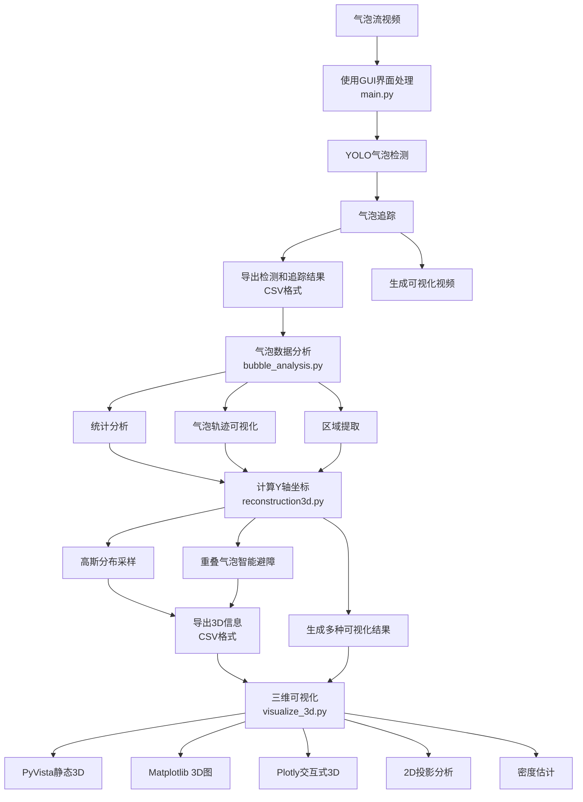
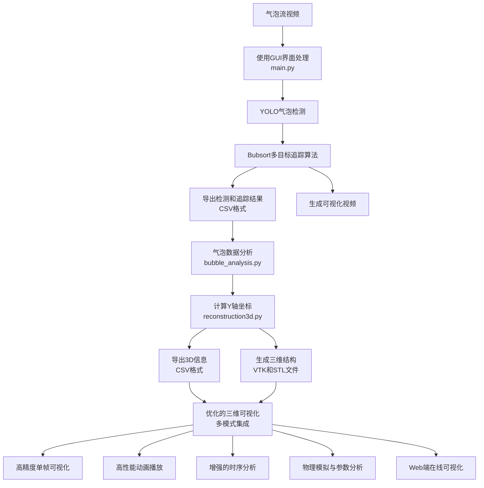

# BFRM - Bubbly Flow Reconstruction Model

本软件用于将高速相机拍摄的气泡动态流场图像重建为3D的气泡结构。

## 功能介绍
1. 手动选择数据文件夹（默认路径：/home/yubd/mount/dataset/individual_bubble）。
2. 手动选择视频文件，支持常见格式如MP4、AVI、MOV和MKV。
3. 根据 CSV 筛选气泡图像，并根据气泡坐标参数对图像进行扩展和定位。
4. 对选择的视频文件进行逐帧处理和显示。
5. 生成连续气泡流图像的 GIF 和 MP4 动画，且实时显示。
6. 根据椭圆参数绘制气泡的矩形边框和拟合椭圆。
7. 进行气泡 3D 重建，显示交互式的 3D 气泡椭球模型。
8. 界面上同时显示四个动图：气泡流图像、带框图像、椭圆图像和 3D 重建图像。
9. 集成YOLO深度学习模型，实现高精度气泡检测。
10. 实时显示气泡信息，包括位置、尺寸、角度、速度和体积。
11. 支持CUDA加速和多线程处理，提高视频播放流畅度。
12. 气泡轨迹跟踪与可视化，支持最多100帧历史轨迹记录。
13. 实时计算气泡速度和体积，提供动态流场分析数据。
14. **基于高斯分布的气泡深度分配**，实现更加自然的三维空间分布。
15. **多视角三维可视化**，提供正视图、俯视图、侧视图和等轴测图。
16. **交互式三维可视化**，支持旋转、缩放和体积颜色映射。
17. **气泡密度分布估计**，提供直观的空间密度分析。
18. **智能重叠处理**，为重叠气泡寻找最优空间位置。
19. **气泡统计分析**，生成静态和动态统计图表。
20. **气泡区域提取**，从原始视频中分离单个气泡区域。
21. **旋转矩形坐标计算**，支持任意角度的气泡定位。
22. **综合结果统计**，包括气泡数量、速度和体积分布。

## 文件结构 
- `main.py`: 主程序入口
- `gui.py`: 图形用户界面实现
- `image_processor.py`: 图像处理模块
- `video_processor.py`: 视频处理模块
- `ellipse_fitting.py`: 椭圆拟合算法
- `reconstruction3d.py`: 3D重建模块
- `animation_exporter.py`: 动画导出工具
- `inference_obb.py`: YOLO推理模块
- `bubble_analysis.py`: 气泡分析与统计工具
- `visualize_3d.py`: 三维可视化工具
- `requirements.txt`: 依赖库列表
- `data/`: 示例数据目录
- `model/`: 预训练模型目录
- `icons/`: 界面图标资源
- `results/`: 处理结果保存目录

## 处理流程

### 第一步：气泡检测与追踪
1. 使用主程序中的GUI界面（main.py）处理气泡流视频
2. 通过YOLO深度学习模型进行气泡检测
3. 导出每一帧的气泡检测和追踪的结果（位置、尺寸、角度等信息）
4. 生成气泡检测和追踪的可视化视频

### 第二步：气泡分析与统计
1. 使用bubble_analysis.py对检测结果进行分析
2. 统计每一帧的气泡数量、尺寸分布、速度分布和角度分布
3. 生成静态统计图表，展示整个视频的气泡特征分布
4. 创建动态统计动画，展示气泡特征随时间的变化趋势
5. 提取单个气泡区域，用于后续分析
6. 可视化检测结果和气泡轨迹
7. 生成综合结果报告

### 第三步：三维重建
1. 使用reconstruction3d.py计算气泡的y轴（深度）坐标
   - **新增**：基于x坐标的高斯分布进行y坐标采样
   - **新增**：单个气泡随机采样，重叠气泡智能避障
   - **新增**：使用气泡半径和体积作为空间分配的关键参考因素
2. 导出计算后的CSV文件，包含气泡的完整3D信息
3. 生成丰富的可视化结果：
   - 静态图像：3D视图、2D投影、密度估计
   - 交互式HTML：多视角、体积热图、可交互模型

### 第四步：三维可视化
1. 提供多种可视化方式：
   - **新增**：PyVista 3D可视化
   - **新增**：Matplotlib 3D散点图
   - **新增**：Plotly交互式3D可视化
   - **新增**：三平面2D投影
   - **新增**：气泡密度估计
2. 交互式3D界面，支持旋转、缩放和颜色映射等操作
3. 基于空间密度分析气泡分布特性

### 未来工作计划
1. 在第一步获得检测结果后，自行开发Bubsort追踪算法对气泡的动态演化进行多目标追踪
2. 基于追踪结果，再使用reconstruction3d.py文件计算气泡的深度坐标
3. 优化3D重建算法，提高计算精度和效率
4. 扩展可视化功能，支持更多数据分析和展示方式
5. 整合物理模拟模块，提供气泡动力学分析

## 工作流程图

### 当前工作流程


### 未来工作流程


## 安装与使用
1. 安装依赖
```bash
pip install -r requirements.txt
```

2. 运行主程序
```bash
python main.py
```

3. 使用气泡分析功能
```bash
python bubble_analysis.py
```

4. 使用三维重建功能
```bash
python reconstruction3d.py
```

5. 使用三维可视化功能
```bash
python visualize_3d.py
```

6. 查看三维可视化结果
```bash
# 打开生成的HTML文件查看交互式3D可视化
# 结果保存在results目录下
```

## 气泡分析模块 (bubble_analysis.py)

bubble_analysis.py模块提供了一套完整的气泡流数据分析工具，主要功能包括：

1. **数据加载与预处理**：
   - 自动识别并排序CSV格式的气泡检测结果
   - 支持加载原始视频文件进行可视化
   - 处理各种角度的旋转矩形坐标

2. **统计分析功能**：
   - 分析所有帧的气泡特征，包括数量、尺寸、速度和角度
   - 生成静态统计图表，展示整体分布情况
   - 创建动态统计动画，展示参数随时间的变化

3. **可视化功能**：
   - 可视化检测结果，在原始视频上绘制气泡边界框
   - 可视化气泡轨迹，展示气泡运动路径
   - 支持限制轨迹长度，降低视觉复杂度

4. **气泡区域提取**：
   - 从原始视频中提取单个气泡区域
   - 支持旋转气泡区域，处理任意角度的气泡
   - 保存提取的气泡图像，用于进一步分析

5. **结果汇总**：
   - 生成综合结果报告，包括气泡总数、平均速度等
   - 输出详细的统计信息，便于数据分析

该模块通过分析气泡流中的各种特征，为理解气泡动力学行为提供了重要的量化工具，是气泡流研究的关键组件。

## 新增特性：高斯分布采样三维重建

本次更新引入了基于高斯分布的气泡深度采样算法，大幅提升了三维重建的自然性和准确性。主要改进包括：

1. **高斯分布拟合**：对x坐标分布进行高斯拟合，获取均值和标准差
2. **基于物理特性的深度分配**：
   - 单个气泡采用高斯随机采样
   - 重叠气泡使用智能避障算法
3. **考虑气泡体积和半径**：气泡体积越大，需要的空间距离越大
4. **自适应距离阈值**：根据重叠状况动态调整距离阈值
5. **多阶段采样优化**：如果找不到理想位置，会降低阈值继续尝试

这种方法使气泡的三维空间分布更加合理，重叠气泡的位置分配更加符合物理特性，大大提高了三维重建的准确性和可信度。

## 新增特性：多维可视化

本次更新提供了多种可视化方式，满足不同分析需求：

1. **3D可视化**：
   - PyVista静态3D视图
   - Matplotlib 3D散点图
   - Plotly交互式3D模型（支持旋转、缩放）
   
2. **多视角展示**：
   - 前视图
   - 俯视图
   - 侧视图
   - 等轴测图
   
3. **2D投影分析**：
   - XY平面投影
   - XZ平面投影
   - YZ平面投影
   
4. **密度分析**：
   - XY平面密度等高图
   - XZ平面密度等高图
   - YZ平面密度等高图
   - 体积分布直方图

这些可视化工具帮助研究人员从多角度分析气泡流场特性，提供深入的物理洞察。

## 联系与贡献

欢迎提交问题和建议，或直接贡献代码。