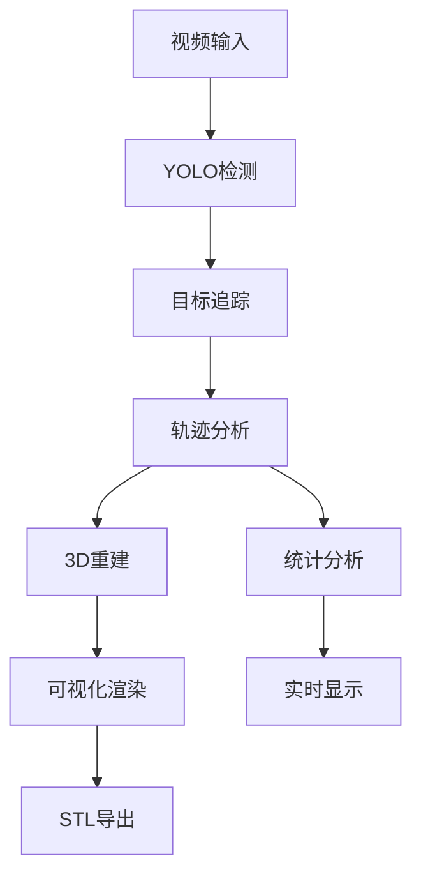

# BFRM - Bubble Flow Reconstruction and Measurement (Realtime)

<div align="center">


[](https://opensource.org/licenses/MIT)
[](https://www.python.org/downloads/)
[](https://www.riverbankcomputing.com/software/pyqt/)
[](https://github.com/AI4CT/BFRM/stargazers)

**实时气泡流重建与测量系统**

[English](README_EN.md) | [中文](README.md)

</div>

## 📖 项目简介

BFRM (Bubble Flow Reconstruction and Measurement) Realtime是一个基于计算机视觉和深度学习的实时气泡流分析系统。该系统能够实时处理高速相机拍摄的气泡流图像，通过YOLO目标检测、多目标追踪、三维重建等技术，实现气泡流的实时监测、分析和三维可视化。

### 🔥 主要特性

- **🎥 实时视频处理**: 支持多种格式的视频实时读取和处理
- **🔍 智能气泡检测**: 基于YOLOv11的高精度气泡检测和分类
- **📍 多目标追踪**: 采用BotSort算法实现气泡轨迹追踪
- **🔄 三维重建**: 基于单图像的气泡流三维空间重建
- **📊 实时可视化**: 同步显示原始视频流和三维重建结果
- **💾 STL导出**: 实时生成并导出STL格式三维模型
- **📈 统计分析**: 实时气泡计数、速度、体积等参数分析
- **🖱️ 交互操作**: 支持3D场景交互操作和多视角查看

## 📸 系统截图

<div align="center">


</div>

## 🚀 快速开始

### 系统要求

- **操作系统**: Windows 10/11, Linux, macOS
- **Python**: 3.8 或更高版本
- **内存**: 8GB RAM（推荐16GB+）
- **显卡**: NVIDIA GPU（支持CUDA，可选但推荐）
- **存储**: 10GB+ 可用空间

### 安装步骤

1. **克隆仓库**
```bash
git clone https://github.com/AI4CT/BFRM.git
cd BFRM
```

2. **创建虚拟环境**
```bash
python -m venv venv

# Windows
venv\Scripts\activate

# Linux/macOS
source venv/bin/activate
```

3. **安装依赖**
```bash
pip install -r requirements.txt
```

4. **下载YOLO模型**
- 下载预训练的YOLO模型文件
- 将模型文件放置在 `model/` 目录下
- 更新 `config.py` 中的模型路径

5. **运行程序**
```bash
python main_realtime.py
```

## 📁 项目结构

```
BFRM/
├── main_realtime.py         # 主程序入口
├── realtime_gui.py          # GUI界面模块
├── realtime_processor.py    # 实时处理核心
├── config.py                # 配置管理
├── requirements.txt         # 依赖列表
├── README.md               # 项目文档
├── ROADMAP.md              # 开发路线图
├── LICENSE                 # 许可证
├── model/                  # YOLO模型目录
├── icons/                  # 图标资源
├── docs/                   # 文档目录
├── logs/                   # 日志目录
├── results_realtime/       # 输出结果目录
└── temp/                   # 临时文件目录
```

## 🎯 使用指南

### 基本工作流程

1. **启动程序**
   ```bash
   python main_realtime.py
   ```

2. **加载视频**
   - 点击"浏览"按钮选择视频文件
   - 支持格式：MP4, AVI, MOV, MKV

3. **配置参数**
   - 调整处理速度（1-10级）
   - 设置保存选项（中间结果、STL文件）
   - 配置3D可视化参数

4. **开始处理**
   - 点击"开始处理"按钮
   - 实时监控处理进度和统计信息

5. **交互操作**
   - 使用鼠标操作3D场景
   - 切换不同视角
   - 查看详细的气泡信息

6. **导出结果**
   - 手动导出当前帧STL
   - 批量导出所有STL文件

### 界面介绍

#### 左侧面板
- **控制面板**: 文件选择、处理控制、参数设置
- **视频显示**: 实时显示处理后的视频流
- **进度监控**: 处理进度和时间信息

#### 右侧面板
- **3D可视化**: 实时三维气泡流重建
- **统计信息**: 实时数据统计和分析
- **处理日志**: 详细的处理日志记录

## ⚙️ 配置选项

### config.py 主要配置

```python
# YOLO模型配置
yolo_model_path = "model/yolo11x-obb.pt"
yolo_conf_threshold = 0.5
yolo_iou_threshold = 0.7

# 图像参数配置
image_width = 1280
image_height = 800
depth_range = 1280
pixel_scale = 0.080128  # mm/pixel

# 处理参数配置
default_processing_speed = 5
max_trajectory_length = 100
save_intermediate_default = False
save_stl_default = True

# 3D可视化配置
bubble_opacity = 0.7
show_axes = True
show_labels = True
```

### 自定义配置

可以通过以下方式自定义配置：

1. **修改 config.py 文件**
2. **创建 JSON 配置文件**
3. **环境变量配置**

## 🔬 技术架构

### 核心组件

- **GUI模块** (`realtime_gui.py`): PyQt6界面设计和交互
- **处理核心** (`realtime_processor.py`): 多线程实时处理引擎
- **配置管理** (`config.py`): 灵活的配置系统

### 技术栈

- **UI框架**: PyQt6
- **计算机视觉**: OpenCV, YOLO
- **深度学习**: PyTorch, Ultralytics
- **3D可视化**: PyVista, VTK
- **科学计算**: NumPy, Pandas, SciPy
- **数据分析**: Matplotlib, Plotly

### 算法流程



## 📊 性能指标

| 指标 | 数值 |
|------|------|
| 检测精度 | >95% |
| 处理帧率 | 5-30 FPS |
| 追踪准确率 | >90% |
| 内存占用 | <2GB |
| GPU加速 | 支持 |

## 🐛 问题排除

### 常见问题

1. **YOLO模型加载失败**
   - 检查模型文件路径
   - 验证模型文件完整性
   - 查看错误日志

2. **视频无法打开**
   - 确认视频格式支持
   - 检查文件权限
   - 尝试其他视频文件

3. **3D显示异常**
   - 更新显卡驱动
   - 检查OpenGL支持
   - 尝试软件渲染模式

4. **处理速度过慢**
   - 降低处理质量设置
   - 启用GPU加速
   - 关闭不必要功能

### 日志分析

程序运行时会生成详细日志文件：
- GUI日志：记录界面操作和状态
- 处理日志：记录检测和处理过程
- 错误日志：记录异常和错误信息

## 🤝 贡献指南

欢迎贡献代码、报告问题或提出建议！

### 如何贡献

1. Fork 项目仓库
2. 创建特性分支 (`git checkout -b feature/amazing-feature`)
3. 提交更改 (`git commit -m 'Add some amazing feature'`)
4. 推送到分支 (`git push origin feature/amazing-feature`)
5. 创建Pull Request

### 开发环境搭建

1. 克隆开发版本
2. 安装开发依赖：`pip install -r requirements-dev.txt`
3. 运行测试：`pytest tests/`
4. 代码格式化：`black .`

## 📄 许可证

本项目采用 MIT 许可证 - 详见 [LICENSE](LICENSE) 文件

## 👥 开发团队

**AI4CT团队** - Artificial Intelligence for Computational Tomography

- **项目负责人**: Baodi Yu (yubaodi20@ipe.ac.cn)
- **开发团队**: AI4CT Lab

## 🔗 相关链接

- [项目主页](https://github.com/AI4CT/BFRM)
- [离线版本](https://github.com/AI4CT/BFRM/tree/offline)
- [文档中心](https://ai4ct.github.io/BFRM)
- [问题报告](https://github.com/AI4CT/BFRM/issues)

## 📮 联系我们

- **邮箱**: yubaodi20@ipe.ac.cn
- **GitHub**: [@AI4CT](https://github.com/AI4CT)
- **项目讨论**: [Discussions](https://github.com/AI4CT/BFRM/discussions)

## 🙏 致谢

感谢以下开源项目的支持：

- [Ultralytics YOLO](https://github.com/ultralytics/ultralytics)
- [PyVista](https://github.com/pyvista/pyvista)
- [PyQt6](https://www.riverbankcomputing.com/software/pyqt/)
- [OpenCV](https://opencv.org/)

---

<div align="center">

**如果这个项目对您有帮助，请给一个 ⭐ Star！**

© 2024 AI4CT Team. All Rights Reserved.

</div>
