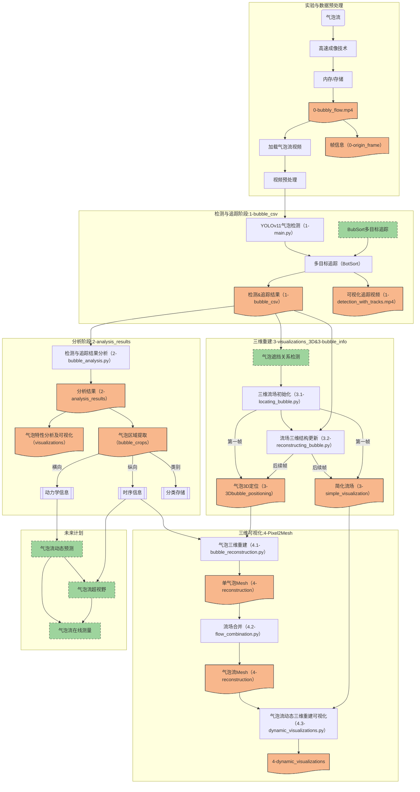
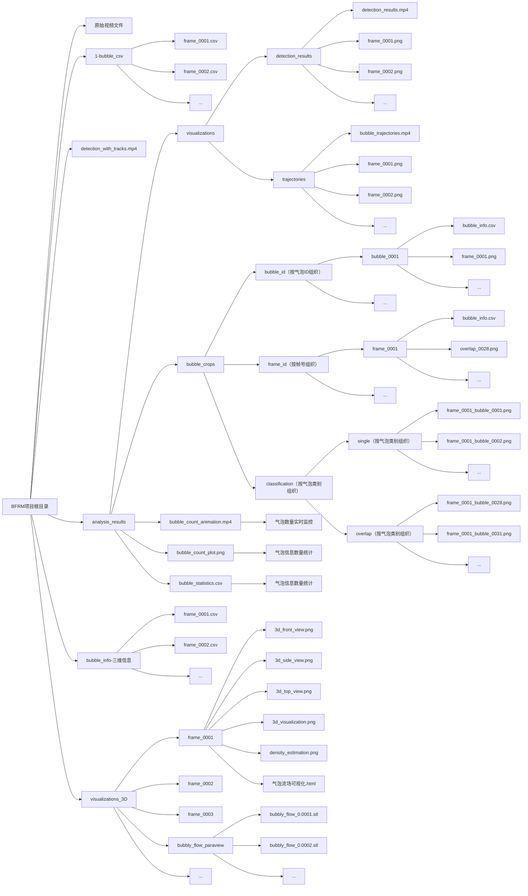

# BFRM系统流程图

## 整体工作流程

```mermaid
graph TD
    subgraph 实验与数据预处理
        Z@{ shape: rounded, label: "气泡流" } --> 高速成像技术
        高速成像技术 --> 内存/存储
        内存/存储 --> Z2@{shape: doc, label: "0-bubbly_flow.mp4"}
        Z2 --> A1[加载气泡流视频]
        Z2 --> A11@{shape: doc, label: "帧信息（0-origin_frame）"}
        A1 --> B1[视频预处理]
    end

    subgraph 检测与追踪阶段:1-bubble_csv
        B1 --> C[YOLOv11气泡检测（1-main.py）]
        C --> D[多目标追踪]
        B2[BubSort多目标追踪] --> D[多目标追踪（BotSort）]
        D --> E@{shape: doc, label: "检测&追踪结果（1-bubble_csv）"}
        D --> F@{shape: doc, label: "可视化追踪视频（1-detection_with_tracks.mp4）"}
    end
    
    subgraph 分析阶段:2-analysis_results
        E --> G1[检测与追踪结果分析（2-bubble_analysis.py）]
        G1 --> G2@{shape: doc, label: "分析结果（2-analysis_results）"}
        G2 --> I@{shape: doc, label: "气泡特性分析及可视化（visualizations）"}
        G2 --> J@{shape: doc, label: "气泡区域提取（bubble_crops）"}
        J -->|横向| J1[["动力学信息"]]
        J -->|纵向| J2[["时序信息"]]
        J -->|类别| J3[["分类存储"]]
    end
    
    subgraph 三维重建:3-visualizations_3D&3-bubble_info
        E --> E1[气泡遮挡关系检测]
        E1 --> L1[三维流场初始化（3.1-locating_bubble.py）]
        L1 --> M[流场三维结构更新（3.2-reconstructing_bubble.py）]
        M -- 后续帧 --> L3@{shape: doc, label: "简化流场（3-simple_visualization）"}
        L1 -- 第一帧 --> L3@{shape: doc, label: "简化流场（3-simple_visualization）"}
        L1 -- 第一帧 --> L2@{shape: doc, label: "气泡3D定位（3-3Dbubble_positioning）"}
        M -- 后续帧 --> L2@{shape: doc, label: "气泡3D定位（3-3Dbubble_positioning）"}
        E --> M
    end

    subgraph 三维可视化:4-Pixel2Mesh
        J2 --> O[气泡三维重建（4.1-bubble_reconstruction.py）]
        L2 --> O[气泡三维重建（4.1-bubble_reconstruction.py）]
        O --> P@{shape: doc, label: "单气泡Mesh（4-reconstruction）"}
        P --> Q[流场合并（4.2-flow_combination.py）]
        Q --> R@{shape: doc, label: "气泡流Mesh（4-reconstruction）"}
        R --> S[气泡流动态三维重建可视化（4.3-dynamic_visualizations.py）]
        L3 --> S[气泡流动态三维重建可视化（4.3-dynamic_visualizations.py）]
        S --> T@{shape: doc, label: "4-dynamic_visualizations"}
    end

    subgraph 未来计划
        W[气泡流动态预测] --> X[气泡流超视野]
        J1 --> W
        J2 --> X
        W[气泡流动态预测] --> V[气泡流在线测量]
        X[气泡流超视野] --> V[气泡流在线测量]
    end
    
    style Z2 fill:#F8B78C,stroke:#333
    style A11 fill:#F8B78C,stroke:#333
    style E fill:#F8B78C,stroke:#333
    style F fill:#F8B78C,stroke:#333
    style G2 fill:#F8B78C,stroke:#333
    style I fill:#F8B78C,stroke:#333
    style J fill:#F8B78C,stroke:#333
    style L2 fill:#F8B78C,stroke:#333
    style L3 fill:#F8B78C,stroke:#333
    style P fill:#F8B78C,stroke:#333
    style T fill:#F8B78C,stroke:#333
    style R fill:#F8B78C,stroke:#333
    style B2 fill:#9ED49D,stroke:#333,stroke-dasharray: 5 5
    style E1 fill:#9ED49D,stroke:#333,stroke-dasharray: 5 5
    style V fill:#9ED49D,stroke:#333,stroke-dasharray: 5 5
    style W fill:#9ED49D,stroke:#333,stroke-dasharray: 5 5
    style X fill:#9ED49D,stroke:#333,stroke-dasharray: 5 5
```

## 文件存储结构

```mermaid
graph LR
    A[BFRM项目根目录] --> B[原始视频文件]
    A --> C[1-bubble_csv]
    A --> D[detection_with_tracks.mp4]
    A --> E[analysis_results]
    A --> F[bubble_info-三维信息]
    A --> G[visualizations_3D]
    
    C --> C1[frame_0001.csv]
    C --> C2[frame_0002.csv]
    C --> C3[...]
    
    E --> E1[visualizations]
    E --> E2[bubble_crops]
    E --> E3[bubble_count_animation.mp4]
    E --> E4[bubble_count_plot.png]
    E --> E5[bubble_statistics.csv]
    
    E1 --> E11[detection_results]
    E1 --> E12[trajectories]
    
    E11 --> E111[detection_results.mp4]
    E11 --> E112[frame_0001.png]
    E11 --> E113[frame_0002.png]
    E11 --> E114[...]
    
    E12 --> E121[bubble_trajectories.mp4]
    E12 --> E122[frame_0001.png]
    E12 --> E123[frame_0002.png]
    E12 --> E124[...]
    
    E2 --> E21[bubble_id（按气泡ID组织）]
    E2 --> E22[frame_id（按帧号组织）]
    E2 --> E23[classification（按气泡类别组织）]

    E21 --> E211[bubble_0001]
    E21 --> E212[...]

    E211 --> E2111[bubble_info.csv]
    E211 --> E2112[frame_0001.png]
    E211 --> E2113[...]

    E22 --> E221[frame_0001]
    E22 --> E222[...]

    E221 --> E2211[bubble_info.csv]
    E221 --> E2212[overlap_0028.png]
    E221 --> E2213[...]

    E23 --> E231[single（按气泡类别组织）]
    E23 --> E232[overlap（按气泡类别组织）]

    E231 --> E2311[frame_0001_bubble_0001.png]
    E231 --> E2312[frame_0001_bubble_0002.png]
    E231 --> E2313[...]
    
    E232 --> E2321[frame_0001_bubble_0028.png]
    E232 --> E2322[frame_0001_bubble_0031.png]
    E232 --> E2323[...]

    E3 --> E31[气泡数量实时监控]
    E4 --> E41[气泡信息数量统计]
    E5 --> E51[气泡信息数量统计]

    F --> F1[frame_0001.csv]
    F --> F2[frame_0002.csv]
    F --> F3[...]
    
    G --> G1[frame_0001]
    G --> G2[frame_0002]
    G --> G3[frame_0003]
    G --> G4[bubbly_flow_paraview]
    G --> G5[...]

    G1 --> G11[3d_front_view.png]
    G1 --> G12[3d_side_view.png]
    G1 --> G13[3d_top_view.png]
    G1 --> G14[3d_visualization.png]
    G1 --> G15[density_estimation.png]
    G1 --> G16[气泡流场可视化.html]

    G4 --> G41[bubbly_flow_0.0001.stl]
    G4 --> G42[bubbly_flow_0.0002.stl]
    G4 --> G43[...]

```

## 图例说明

- ■ 已完成功能
- ■ 部分完成功能
- ■ 未完成功能（计划中）
- - - - 开发中功能
